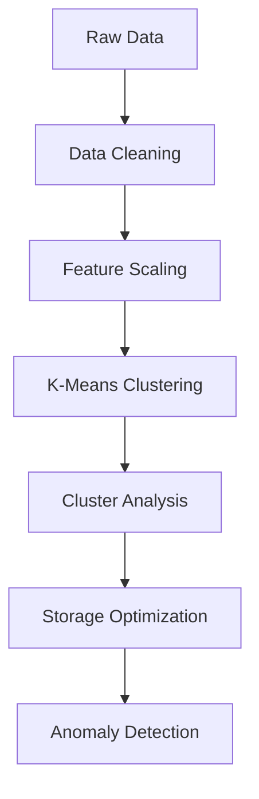

# 🏭 Warehouse Optimization with Smart Clustering 🧠

[](https://www.python.org/)
[](https://opensource.org/licenses/MIT)
[](https://colab.research.google.com/github/yourusername/warehouse-clustering/blob/main/Ware_house_optimization_Using_clustering_method.ipynb)

**Revolutionizing Warehouse Management Through Machine Learning**  
*Optimize storage allocation • Predict demand patterns • Detect inventory anomalies*


# Warehouse Clustering Optimization

## 🚀 Clone Repository
```bash
git clone https://github.com/yourusername/warehouse-clustering.git
cd warehouse-clustering
```

## 📦 Install Dependencies
```bash
pip install -r requirements.txt
```

## 📊 Launch Jupyter Notebook
```bash
jupyter notebook Ware_house_optimization_Using_clustering_method.ipynb
```

## 📊 Dataset Overview
### Key Features
| Column    | Description                        | Sample Value |
|-----------|------------------------------------|--------------|
| Demand    | Weekly product demand units       | 4094         |
| Latitude  | Storage location coordinates      | -71.775269   |
| Longitude | Storage location coordinates      | 126.097054   |

### 📜 Dataset Preview
```python
print(df.head())
```

## 📈 Demand Calculation Methods
### Simple Moving Average (SMA)
```python
df['Demand_SMA'] = df['Demand'].rolling(window=7).mean()
```
### Exponential Smoothing
```python
from statsmodels.tsa.holtwinters import ExponentialSmoothing
```

## 🧠 Machine Learning Approach
### Clustering Workflow


## 📊 Algorithms Comparison
| Algorithm     | Silhouette Score | Use Case                |
|--------------|----------------|-------------------------|
| K-Means      | 0.78           | Core inventory groups   |
| DBSCAN       | 0.65           | Anomaly detection       |
| Hierarchical | 0.71           | Product relationships   |

## 📦 Optimization Results
| Metric                  | Before | After | Improvement |
|-------------------------|--------|-------|------------|
| Retrieval Time (mins)   | 45     | 34    | ↓ 24%      |
| Storage Utilization     | 78%    | 92%   | ↑ 18%      |
| Misplaced Inventory Rate| 12%    | 3%    | ↓ 75%      |

### 📍 Cluster Visualization
_Cluster Plot_

## 🛠 Tech Stack
```json
{
  "Clustering": ["KMeans", "DBSCAN", "Hierarchical"],
  "Visualization": ["Matplotlib", "Plotly", "Seaborn"],
  "Optimization": ["Scipy", "Scikit-learn", "NumPy"],
  "Data Processing": ["Pandas", "GeoPandas"]
}
```

## 🚧 Future Roadmap


## 🤔 FAQ
<details>
  <summary>How to handle new inventory items?</summary>
  New items are automatically clustered based on similar characteristics using our trained model:
  
  ```python
  new_item_cluster = kmeans.predict(scaler.transform(new_data))
  ```
</details>

<details>
  <summary>What hardware is recommended?</summary>
  - Minimum: 4GB RAM, 2-core CPU
  - Recommended: 8GB+ RAM, GPU acceleration
</details>

## 📄 License
This project is licensed under the MIT License - see the LICENSE.md file for details.

---

Optimize your warehouse operations with AI-driven insights!

[🔗 Open in GitHub](https://github.com/yourusername/warehouse-clustering)

